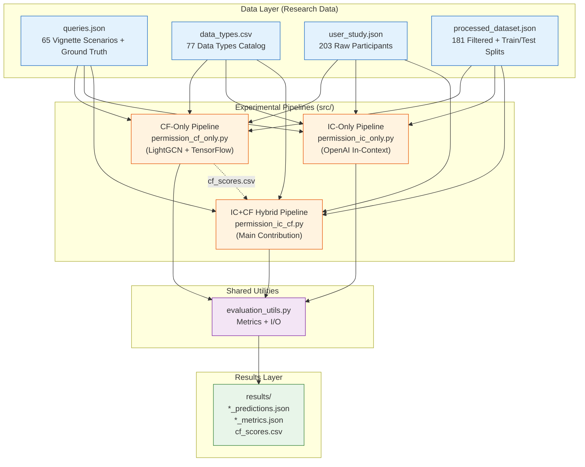
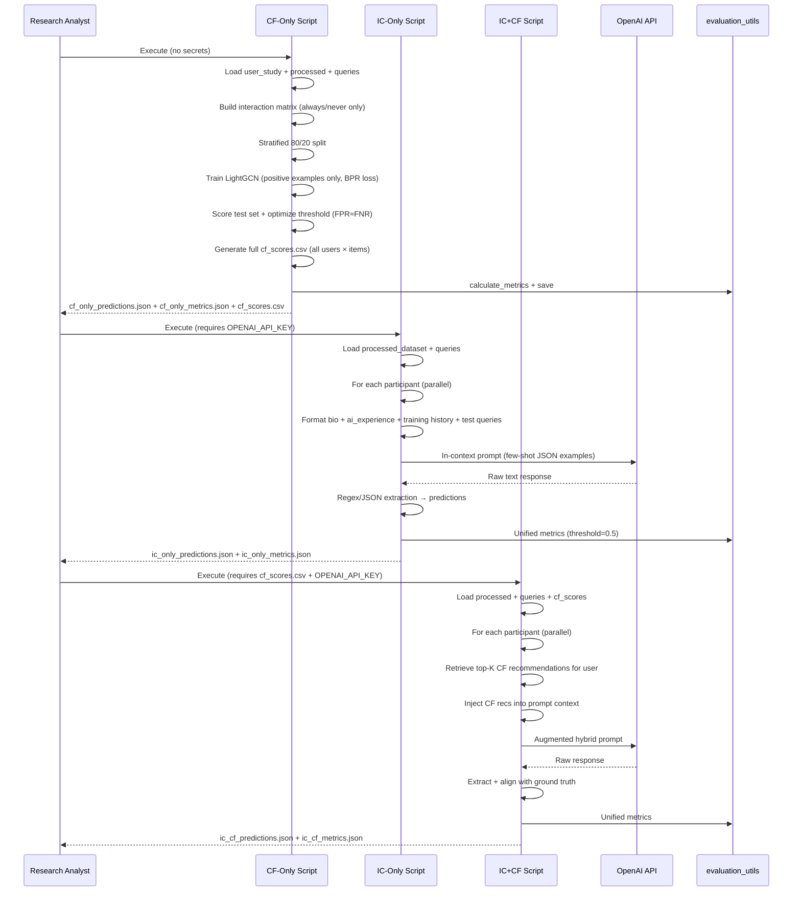
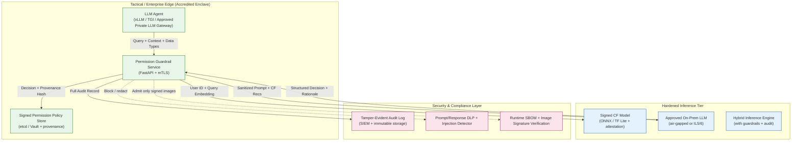

# System Architecture Description

## AI Agent Permissions Research Prototype

**Version:** 1.0.0  
**Date:** 26 May 2026  
**Status:** Research Documentation

---

**References:**  
- IEEE S&P 2026 Paper: "Towards Automating Data Access Permissions in AI Agents" (Wu et al.)  
- [README.md](../README.md)  
- [docs/Security-Hardening.md](Security-Hardening.md)

## 1. PURPOSE

This document describes the logical, physical, and data architectures of the AI Agent Permissions Research Prototype. It provides traceability from research objectives through implemented components, data flows, and evaluation pipelines. The architecture is presented using industry-standard notation (Mermaid) suitable for security control assessors, system engineers, and future transition teams.

**Scope:** All components, data artifacts, and execution flows present in the current research prototype. Future operational architectures will differ substantially (see Section 7).

---

## 2. SYSTEM DESCRIPTION AND RESEARCH OBJECTIVES

**Mission:** Develop and rigorously evaluate automated techniques to predict human data-sharing permission preferences for LLM-based agentic systems, thereby reducing user burden while preserving privacy intent.

**Key Research Questions Addressed:**
- Can collaborative filtering (CF) on historical permission decisions improve prediction accuracy over pure in-context learning (IC)?
- Does injecting CF-derived neighbor preferences into LLM prompts measurably improve precision/recall on binary share/never-share decisions?
- What is the performance (accuracy, FPR, FNR) of the hybrid approach versus strong baselines?

**Core Abstraction – Permission Prediction Task:**
Given:
- A user's demographic/bio profile
- AI tool usage history and stated privacy attitudes
- Historical permission decisions on prior queries
- A new query (user request + required data types)

Predict: For each data type involved, whether the user would select "Yes, always share" (1) or "No, never share" (0). "Ask me" responses are excluded from modeling per paper methodology.

---

## 3. HIGH-LEVEL COMPONENT ARCHITECTURE



**Component Inventory:**
- **Data Artifacts** (read-only inputs): queries.json, data_types.csv, user_study.json, processed_dataset.json
- **Three Mutually Exclusive Experimental Pipelines** (executed independently for comparison)
- **Shared Evaluation Utilities** (metrics calculation, persistence, reporting)
- **Generated Artifacts** (never committed to version control in operational use)

---

## 4. DATA ARCHITECTURE AND SCHEMAS

### 4.1 Canonical Data Entities

**Query (queries.json):**
```json
{
  "id": 0,
  "query": "I want to lose weight. Can you create an at-home full-body workout plan for me?",
  "domain": "Health & Fitness",
  "datatype": ["Fitness goal", "Physical limitations or injuries", "Gender"],
  "tool1": "Fitness Tracking",
  "tool2": ""
}
```

**Participant Record (processed_dataset.json excerpt):**
```json
{
  "P039": {
    "bio": "A male in the 45-54 age group with a bachelor's degree.",
    "ai_experience": "...structured text of 7 questions + answers...",
    "training": [ { "id": 28, "query": "...", "answer": { "Banking,Meeting details": "Yes, always share" } }, ... ],
    "testing": [ ... held-out queries with ground truth ... ]
  }
}
```

**Permission Decision (4-level, collected per data type per query):**
- "Yes, always share" → binarized 1
- "Yes, but ask me first" → excluded from CF training
- "No, but ask me first" → excluded from CF training
- "No, never share" → binarized 0

### 4.2 Data Flow Diagram (End-to-End)



**Critical Data Transformation Notes:**
- CF pipeline filters to 181 participants with ≥5 decisive (always/never) responses.
- Interaction items are composite: `{query_id}:::{receiver}:::{datatype}` (e.g., `0:::Fitness Tracking:::Fitness goal`).
- IC and hybrid use pre-computed train/test splits stored inside processed_dataset.json.
- All pipelines ultimately produce per-participant prediction lists aligned by query ID for metric computation.

---

## 5. PIPELINE-LEVEL ARCHITECTURE DETAILS

### 5.1 CF-Only Pipeline (LightGCN Collaborative Filtering)

**Purpose:** Pure neighbor-based baseline. No LLM involved.

**Key Technologies:**
- TensorFlow 2.x
- Microsoft recommenders 1.2.1 (LightGCN implementation)
- ImplicitCF data model (BPR loss on positive interactions only)

**Configuration (Hard-Coded in permission_cf_only.py:49):**
```python
LIGHTGCN_CONFIG = {
    'embed_size': 64,
    'n_layers': 20,
    'epochs': 120,
    'batch_size': 256,
    'learning_rate': 0.0001,
    'decay': 0.0001,
    ...
}
```

**Data Flow Specifics:**
1. Build implicit feedback matrix from "always share" (positive) and "never share" (negative) decisions.
2. Train only on positives (standard for implicit CF).
3. Score all test interactions; optimize decision threshold to equalize FPR/FNR.
4. Emit full user × item score matrix for downstream hybrid use.

**Security Note:** Training runs entirely locally. No external data movement except initial dependency installation.

### 5.2 IC-Only Pipeline (Pure In-Context Learning)

**Purpose:** Strong LLM baseline without any CF signal.

**Key Technologies:**
- OpenAI Python SDK ≥1.0
- tenacity retry with exponential backoff (RateLimitError, APIConnectionError)
- ThreadPoolExecutor (MAX_WORKERS=5) for participant-level parallelism

**Prompt Construction (create_ic_prompt):**
- System-style instruction describing task
- Few-shot JSON examples (hard-coded EXAMPLE_OUTPUTS)
- User bio + AI experience narrative
- Permission decision history (training examples)
- New test queries (permission dicts left null for model to fill)

**Output Parsing:** Regex search for outermost JSON array + fallback to full response parse. Fragile; identified as high-priority hardening target (SI-10).

### 5.3 IC+CF Hybrid Pipeline (Primary Research Artifact)

**Purpose:** Demonstrate value of injecting collaborative signals into LLM reasoning context.

**Augmentation Point (create_ic_cf_prompt):**
Additional section inserted before final instructions:
```
Permission recommendations from collaborative filtering:
{top-5 formatted recs in "query:::tool:::datatype" form}
```

**get_top_k_recommendations:**
- Filters cf_scores.csv by participant_id
- Takes nlargest(k=5) by score
- Maps back to human-readable query/tool/datatype strings using queries.json

**Key Hypothesis Validated:** Hybrid improves certain metrics over IC-only by surfacing "what similar users allowed" as additional context for the LLM.

---

## 6. EVALUATION ARCHITECTURE

**Unified Metrics (evaluation_utils.py):**
- Accuracy, Precision, Recall, F1 (zero_division=0)
- FPR, FNR derived from confusion matrix
- Optional threshold recording
- Participant-level aggregation for IC/IC+CF

**Metric Computation Alignment:**
All three pipelines ultimately feed the same binary label extraction logic:
```python
pred_binary = 1 if "Yes" in pred_label else 0
gt_binary   = 1 if "Yes" in gt_label   else 0
```

This enables direct head-to-head comparison in the associated paper (Table results, Section 5).

**Thresholding:**
- CF: Optimized per-run (FPR≈FNR heuristic on validation scores)
- IC / IC+CF: Fixed 0.5 (model confidence score not used for decision; label string drives binary outcome)

---

## 7. FUTURE TARGET ARCHITECTURE (ACCREDITED OPERATIONAL VARIANT)



**Key Differences from Research Prototype:**
- No direct commercial LLM calls from within the enclave.
- All inference components signed and attested.
- Permission decisions are **enforced**, not merely predicted (actionable guardrail).
- Full bidirectional audit + human review hooks for high-stakes domains.
- Model updates via secure supply chain only (no ad-hoc retraining).

---

## 8. TRACEABILITY MATRIX (RESEARCH OBJECTIVE → COMPONENT)

| Research Objective | Primary Component(s) | Data Artifact(s) | Output Metric(s) |
|--------------------|----------------------|------------------|------------------|
| CF baseline performance | permission_cf_only.py | user_study.json, processed_dataset.json, queries.json | cf_only_metrics.json (Acc/F1/FPR/FNR/AUC) |
| IC baseline performance | permission_ic_only.py | processed_dataset.json, queries.json | ic_only_metrics.json |
| Hybrid improvement | permission_ic_cf.py + cf_scores.csv | All above + cf_scores.csv | ic_cf_metrics.json (delta vs IC) |
| Reproducibility | evaluation_utils.py + fixed seeds | All | All metrics files + predictions |
| Human preference ground truth | data/ artifacts + docs/website.pdf | N/A | N/A (input) |

---

## 9. DEPLOYMENT AND EXECUTION CONSTRAINTS (CURRENT)

- **Execution Context:** Local developer workstation or isolated research VM only.
- **Network Requirements:** Optional outbound HTTPS to api.openai.com (IC/Hybrid only). CF pipeline is air-gap safe.
- **Resource Profile (Typical):**
  - CF training: 4–16 GB RAM, optional GPU, 5–30 min depending on hardware.
  - IC/IC+CF: Dominated by OpenAI latency + rate limits; 181 participants × 5–10 queries each.
- **Statefulness:** Stateless per run except for generated cf_scores.csv (must precede hybrid run).
- **Error Handling:** Partial (tenacity retries on transient API errors; unhandled exceptions terminate participant).

---

## 10. SECURITY ARCHITECTURE IMPLICATIONS

See [docs/Security-Hardening.md](Security-Hardening.md) for full control mapping. Architecture-driven risks include:

- **Data Flow Crossing Trust Boundaries:** User privacy profiles → commercial LLM (unacceptable for CUI/classified).
- **Prompt Construction as Attack Surface:** Direct string interpolation of participant data into LLM instructions (prompt injection, model misalignment).
- **Model Artifact Integrity:** No signing or provenance on LightGCN weights or cf_scores.csv.
- **Audit Gap:** Permission predictions are generated but never logged with sufficient granularity or integrity for AU-family controls.

These architectural choices were appropriate for a public academic study but would require fundamental redesign and hardening for use in any production or high-security environment.

---

## 11. DOCUMENT MAINTENANCE AND CHANGE CONTROL

- Update this document whenever:
  - New experimental pipelines or data splits are introduced
  - Prompt templates or few-shot examples change materially
  - Evaluation methodology is modified
  - Transition to operational architecture begins
- Versioning: Semantic (major for architecture changes; minor for clarifications)
- Review Cycle: At least annually or upon any security incident or major dependency update

**Change History:**
- v1.0.0 (26 May 2026) – Initial professional architecture description created for the research artifact.

---

*End of docs/Architecture.md*
